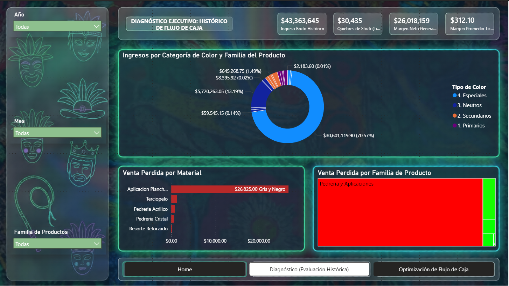
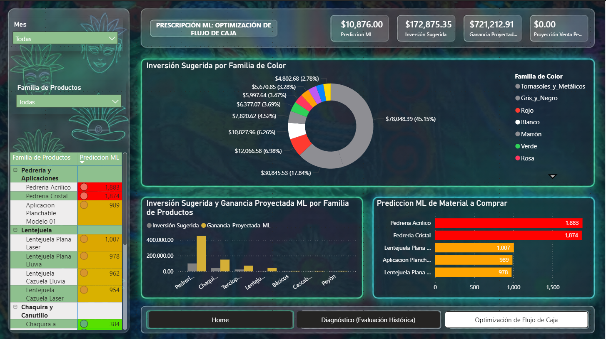

# Gemelo Digital: Mitigación de Lucro Cesante

Proyecto E2E (End-to-End) de Ciencia de Datos desarrollado para la certificación *Citizen Data Scientist*, enfocado en la resolución de problemas de inventario en entornos con ausencia de datos históricos estructurados[cite: 1, 2].``

## 🎯 El Problema
En "Mercería Tommy", la gestión de inventarios se realizaba de forma empírica y sin registros transaccionales, lo que resultaba en quiebres de stock y pérdidas operativas[cite: 1, 3].

## 🛠️ La Solución
Desarrollé un **Gemelo Digital** basado en simulación estocástica para modelar el comportamiento del negocio:

*   **Motor de Simulación (Python):** Inyección de reglas de negocio, estacionalidad forzada (eventos culturales como el Carnaval de Tlaxcala) y ruido blanco para simular la incertidumbre del retail[cite: 2, 3].
*   **Machine Learning (Challenger Mode):** Comparativa entre estadística clásica y algoritmos de ensamble (LightGBM vía PyCaret), priorizando la minimización del RMSE sobre un R² irreal para garantizar certidumbre operativa.
*   **Visualización Prescriptiva (Power BI):** Despliegue de un dashboard con UI/UX optimizada en *Dark Mode*, diseñado para actuar como un brazo ejecutor que prescribe qué comprar y cuándo[cite: 3].

## 📈 Impacto
*   **Optimización financiera:** Estrategia orientada a mitigar hasta $28,000 MXN en lucro cesante[cite: 3].
*   **E2E Pipeline:** Ingesta, simulación, modelado y visualización prescriptiva orquestada con recursos locales[cite: 3].

## 🚀 Arquitectura
*   **Lenguajes:** Python (Simulación y Modelado).
*   **Entorno:** Conda Local[cite: 1].
*   **Visualización:** Power BI (Power Query + Modelos .pkl)[cite: 3].

## 📊 Evidencia Visual del Dashboard

Aquí puedes ver el funcionamiento del sistema en Power BI:

### Diagnóstico Histórico

### Optimización y Prescripción de Flujo de Caja

---
*Autor: Carlos Escalante Sánchez*
*Proyecto Integrador de Dominio Autónomo (PIDA)*[cite: 1]
